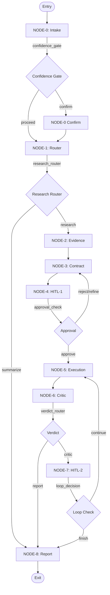

# ARE Architecture Overview

The Autonomous Research Engineer (ARE) is orchestrated using **LangGraph**, providing a robust, state-machine-driven workflow for autonomous scientific research.

## High-Level Topology

ARE operates as a multi-node state machine. Each node is responsible for a distinct phase of the research lifecycle, and conditional edges govern the transitions between these phases.

## GraphState Lifecycle

The core of ARE is the `GraphState`, a `TypedDict` that acts as the shared memory for all nodes. It is incrementally updated as the graph progresses.

### Lifecycle Groups

1. **INTAKE (Node 0)**: Captures the `research_question`, `intent_confidence`, `variables`, and `autonomy_level`. Once Node 0 completes, the core research parameters are considered READ-ONLY.
2. **ROUTER (Node 1)**: Assigns the `research_status` (`well-studied`, `partial`, `novel`) to determine if empirical execution is required.
3. **EVIDENCE (Node 2)**: Populates `evidence` (paper metadata) and identifies `knowledge_gaps`.
4. **CONTRACT (Node 3 & 4)**: Generates the formal `research_contract` outlining hypotheses and tasks, and records `human_decisions` for audit trails.
5. **EXECUTION (Node 5)**: Tracks `execution_status`, raw `execution_logs`, and resulting data `artifacts`.
6. **REVIEW (Node 6)**: Assigns the scientific `verdict` (`conclusive`, `inconclusive`, `contradictory`) and overall `confidence` score.
7. **LOOP (Node 7)**: Records the `loop_decision` (continue or terminate) based on human review of the inconclusive results.
8. **REPORTING (Node 8)**: Generates the final `report_markdown` and `report_json`.
9. **SYSTEM (Cross-cutting)**: Global parameters like `execution_mode` (e.g., `dry_run`), `random_seed`, and `errors`.

## Graph Orchestration Details

Orchestration is primarily managed in `src/are/graph.py` through conditional edge strategies:

- **confidence_gate (N0 → N1/N0C):** Halts for user confirmation if the intent confidence is below 0.7 or clarification is required.
- **research_router (N1 → N2/N8):** Short-circuits the pipeline directly to reporting if the topic is `well-studied`.
- **verdict_router (N6 → N7/N8):** Routes to Human-in-the-Loop review (N7) if the scientific verdict is inconclusive or requires iterations.
